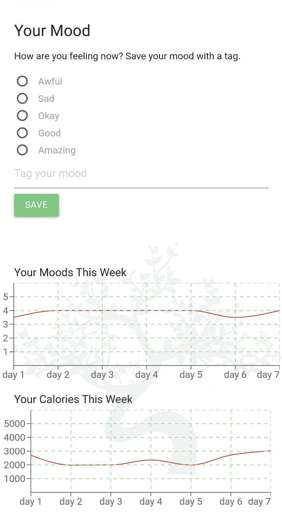

## Welcome to Niwa!

Hello! We built a wellbeing app for our final project. We put this together in six days, after learning React for three days. It uses the following packages:

- Materialize CSS
- React Countdown Now
- React Router DOM
- Recharts

We built a backend using Spring, which you can find here:

https://github.com/kirvine87/niwa_server

You'll need to run this in order to save or view data in the app.

For our final project we were given the following spec:

- It must be a React / Spring web app
- It must contain a number of associations between classes - one to many, many to many etc.
- It must contain some custom logic - this could be filtering, sorting etc.

Niwa covers all of these bases and more.

### Screenshots
   

### Our MVP Spec
"A wellbeing app that allows you to journal in the morning, reflect on your day in the evening with both short questions and a series of check boxes. It also allows you to keep track of your mood throughout the day. You can add a mood any time and tag it with details.

You can keep track of other wellbeing details, such as your calorie count and weight.

Saves info for each date, for sorting and filtering.

*MVP Features*:

- “[Morning pages](https://www.theguardian.com/lifeandstyle/2014/oct/03/morning-pages-change-your-life-oliver-burkeman)” - journal for 500 words each day
- Nightly reflection - your three wins for the day
- Track your calories, moods, and achievements for the day, like: Did you drink enough water? Did you meditate? Did you exercise?
- View mood data - graphs
- Tells you how many days you’ve done it in a row in order to motivate you
- Meditation timer

### Extensions
- Calendar system - filter by day, week, or month
- The app will have an extra set of questions on weekends that ask you how your week went overall, and present your weekly point score.
- Auto-saving as you type
- Dummy login page

### Super Extensions
- Email or text alerts to tell you it’s time to journal and time to reflect
- Mood boosters - texts or emails
- Gamification - achievements
- Total Daily Energy Expenditure  (TDEE) calculator
- Configuration - choose exactly what you want to track

### Hyper Extensions
- Connects to external APIs (MyFitnessPal, Samsung Health, Google Fit, etc) to automatically pull in weight/calorie/exercise information.
- Workout of the day (possibly from an external API)
- Use the [Regressive Imagery Dictionary](https://www.kovcomp.co.uk/wordstat/RID.html) to provide automated analysis of journal entries

## Results
By day six, we managed to get the basic MVP up and running, as well as several of our extensions. We created a dummy login page, and implented some basic gamification features. We ran into a few issues that we'd love to iron out in future. These include moving some of the front-end logic to the back end to avoid browser incompatibility problems, and some UX niggles here and there.

We'd also like to implement more of our advanced ideas, such as a fully featured calendar system, and pulling in data from external APIs to automate things further.

Thank you for checking out our work!

### Notes

This project was bootstrapped with [Create React App](https://github.com/facebook/create-react-app).

## Available Scripts

In the project directory, you can run:

### `npm start`

Runs the app in the development mode. 
Open [http://localhost:3000](http://localhost:3000) to view it in the browser.

The page will reload if you make edits. 
You will also see any lint errors in the console.

### `npm test`

Launches the test runner in the interactive watch mode. 
See the section about [running tests](https://facebook.github.io/create-react-app/docs/running-tests) for more information.

### `npm run build`

Builds the app for production to the `build` folder. 
It correctly bundles React in production mode and optimizes the build for the best performance.

The build is minified and the filenames include the hashes. 
Your app is ready to be deployed!

See the section about [deployment](https://facebook.github.io/create-react-app/docs/deployment) for more information.

### `npm run eject`

**Note: this is a one-way operation. Once you `eject`, you can’t go back!**

If you aren’t satisfied with the build tool and configuration choices, you can `eject` at any time. This command will remove the single build dependency from your project.

Instead, it will copy all the configuration files and the transitive dependencies (Webpack, Babel, ESLint, etc) right into your project so you have full control over them. All of the commands except `eject` will still work, but they will point to the copied scripts so you can tweak them. At this point you’re on your own.

You don’t have to ever use `eject`. The curated feature set is suitable for small and middle deployments, and you shouldn’t feel obligated to use this feature. However we understand that this tool wouldn’t be useful if you couldn’t customize it when you are ready for it.

## Learn More

You can learn more in the [Create React App documentation](https://facebook.github.io/create-react-app/docs/getting-started).

To learn React, check out the [React documentation](https://reactjs.org/).

### Code Splitting

This section has moved here: https://facebook.github.io/create-react-app/docs/code-splitting

### Analyzing the Bundle Size

This section has moved here: https://facebook.github.io/create-react-app/docs/analyzing-the-bundle-size

### Making a Progressive Web App

This section has moved here: https://facebook.github.io/create-react-app/docs/making-a-progressive-web-app

### Advanced Configuration

This section has moved here: https://facebook.github.io/create-react-app/docs/advanced-configuration

### Deployment

This section has moved here: https://facebook.github.io/create-react-app/docs/deployment

### `npm run build` fails to minify

This section has moved here: https://facebook.github.io/create-react-app/docs/troubleshooting#npm-run-build-fails-to-minify
